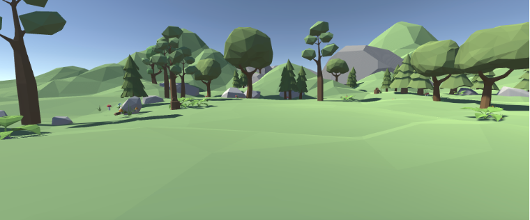
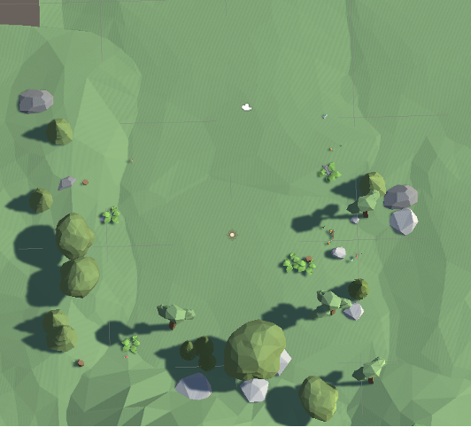
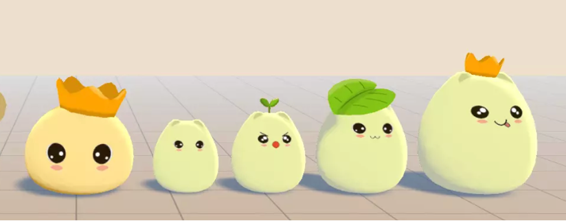

## 슈팅게임

이름: Slime Hunter

## 컨셉소개

핸드 트래킹이 가능한 VR기기의 장점을 살려 오락실의 건 슈팅게임을 만드는것이 목표

## 플레이방식

시간이 지날수록 난이도가 올라가는 엔드리스 방식

## 게임배경

# 맵 형태 

- 기모즈 Z축

{: .light }
> Low-Poly Simple Nature Pack라는 무료 에셋을 사용

- 기모즈 Y축

## 게임 매커니즘

몬스터 스폰 메커니즘 
- 초기에는 느린 속도로 몬스터 스폰
- 게임 진행 시간이 증가 할수록 스폰 속도 및 몬스터 수 증가
- 슬라임 종류에 따라 공격 속도가 다름

> Kawaii Slime라는 무료 에셋을 사용

