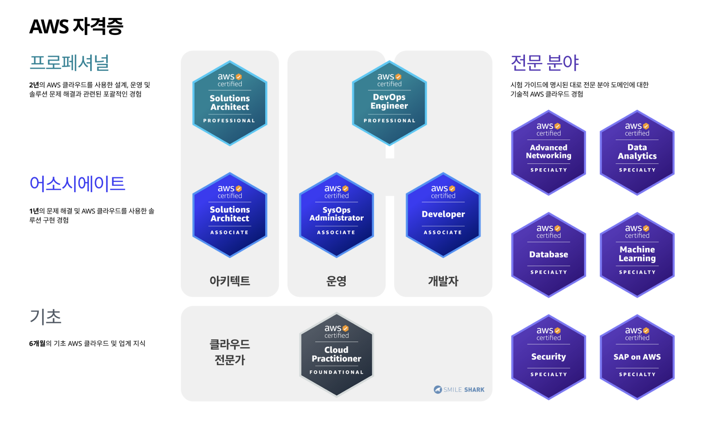

## AWS자격증 종류

> Foundational  > Associate  > Professional > Speciality 으로 나뉜다. 

## ✏AWS Solutions Architect - Associate (SAA)

------------------

AWS 홈페이지에 나와있는 SAA의 설명이다. 

>  - 컴퓨팅, 네트워킹, 스토리지 및 데이터베이스 AWS 서비스는 물론, AWS 배포 및 관리 서비스에 대한 지식과 기술
>  - AWS에서 워크로드를 배포, 관리, 운영한 경험과 보안 제어 및 규정 준수 요구 사항 구현에 대한 지식과 기술
>  - 주어진 기술 요구 사항에 부합하는 AWS 서비스를 식별하고 AWS 기반 애플리케이션의 기술 요구 사항을 정의하는 능력

시험 비용과 문항수는 다음과 같으며 <mark>한국어</mark>를 지원한다. 

- 레벨: 어소시에이트
- 길이: 시험 완료까지 130분 소요
- 비용: 150 USD
- 형식: 65개 문항, 다항 선택 또는 복수 응답

## 공부법

1. 유데미
- 한글자막을 지원하며 꽤 꼼꼼하게 알려주며 실습도 진행하여 이해하기 쉽다. 
> <https://www.udemy.com/course/best-aws-certified-solutions-architect-associate/>

2. 덤프문제 
- 덤프문제가 있는 다양한 사이트들이 있다. 예를들어 examtopics
><https://www.examtopics.com/exams/amazon>

## 후기 

------------------

유데미와 공부한 후 examtopics 사이트에서 덤프문제를 풀었는데 영어밖에 없고 생각보다 난잡했다.  
총 1600문제가 있는 한국어로 된 덤프파일을 구해서 하루 300문제씩 두달동안 공부했더니 엄청 여유롭게 합격할 수 있었다.  

온라인 응시도 지원하는데 감독관이랑 소통할 언어는 한국어가 없어서 그나마 들을 수 있는 일본어로 골랐다..   
일주일에 몇 번이나 있을정도로 시험이 많으니 응시비가 비싼만큼 준비된 다음 신청해도 될 것 같다.   

___처음 응시했을때 mac북 환경이라 잘 안되서 재응시 하였으니 mac북은 미리 winodow 노트북을 준비하자.___

