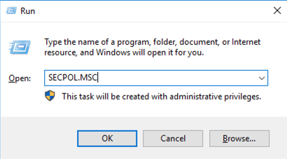
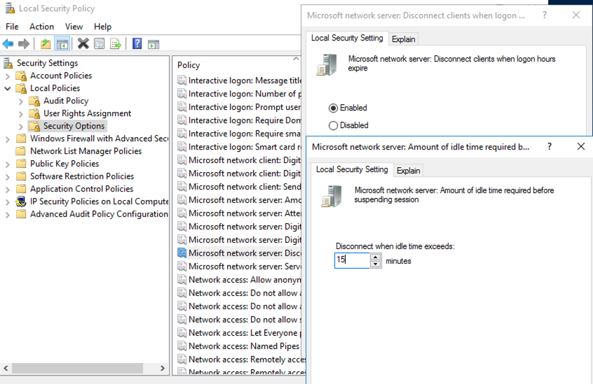

## SRV-029
- 세션 연결 중단 시 유휴시간 설정 여부 점검

## 보안 위협
- 세션이 중단되기 전에 SMB(서버 메시지 블록) 세션에서 보내야 하는 연속 유휴 시간을 결정하여 서비스 거부 공격 등에 악용되지 않도록 하기 위함
- SMB 세션에서는 서버 리소스를 사용하며, null(공백) 세션수가 많으면 서버 속도가 느려지거나 서버에 오류를 발생시킬 수 있으므로 공격자는 이를 악용하여 SMB 세션을 반복 설정하여 서버의 SMB 서비스가 느려지거나 응답하지 않게 하여 서비스 거부 공격을 실행 할 수 있음

## 판단 기준
- SMB세션 중단 설정이 15분으로 되어 있는 경우 양호

## batch 파일 실행하여 진단 결과 확인
>

- 유휴시간 설정이 무제한이므로 취약점 발견.

## 대처 방안
- 시작> 실행> SECPOL.MSC> Local Policy> Security Options
>

-  Microsoft network server: Disconnect clients when logon hours expire -> enable
-  Microsoft network server: Amount of idle time required before suspending session -> 15 minutes 
>

## 대처 후 진단 결과 확인
>

- SMB session MaxIdleTime 15분 설정 완료.  (0xf = 15)

## 코드 보러가기 (github)
- <a href= "https://github.com/erika2852/SRV-029/blob/main/SRV-029.bat"> SRV-029.bat(github)</a>