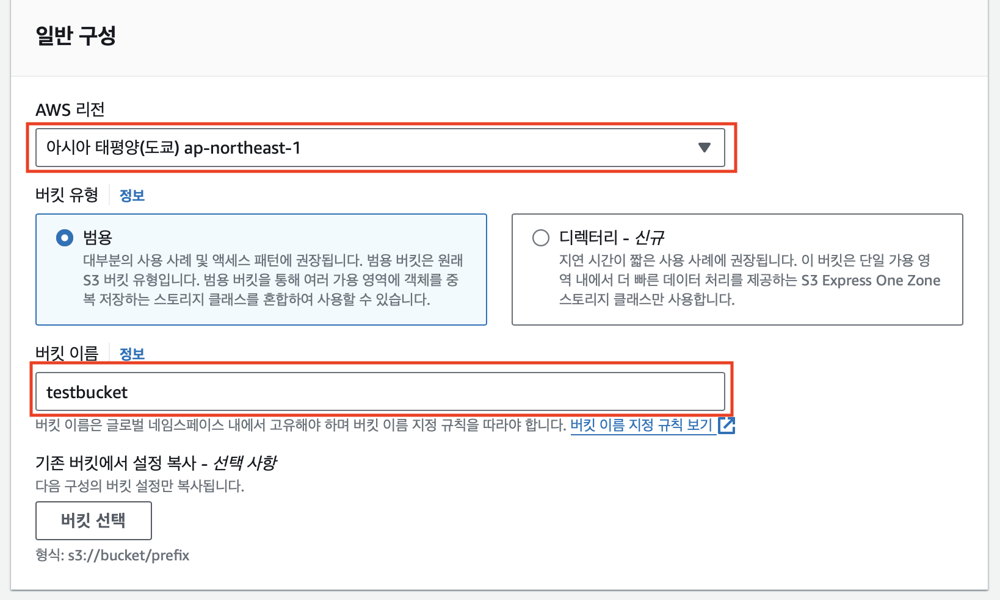
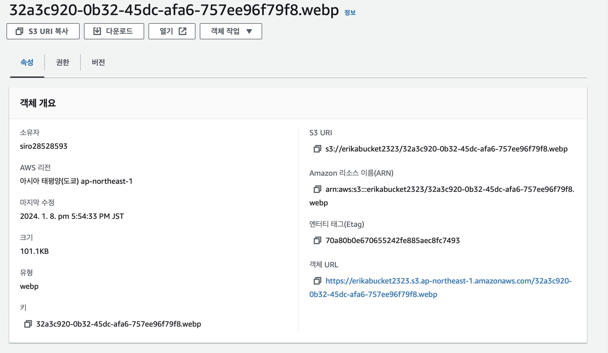

## 1. AWS S3(Simple Storage Service)란?
> 아마존에서 제공하는 __인터넷 스토리지 서비스__ 
> - 높은 내구도 
> - 빠른 속도
> - 저렴한 가격이 특징

## 2. 버킷 만들기 
### 1) 버킷 만들기 클릭

>

2) 버킷 이름, 리전 선택

>
> 리전은 여러개의 AZ로 __본인이 있는 지역 또는 나라__ 를 선택 

### 3) 퍼블릭 액세스 설정

>

> - 추후 정적 웹 호스팅을 할 예정이라 퍼블릭 엑세스 허용 
> - 퍼블릭 액세스를 차단할경우, IAM에서 AWSAccessKeyId, AWSSecretKey를 발급받고 키를 이용해서 S3 객체에 접근 가능

### 4) 버전관리, 암호화 설정

>
>

버전관리와 암호화는 비활성화 

### 5) 버킷 만들기 버튼 클릭

>

### 6) 업로드 테스트 

>
업로드 버튼 클릭

>
> 파일 선택 후 업로드 버튼 클릭

### 7) 버킷 정책 편집 
>
> 버킷에 권한 부분을 들어가서 스크롤을 내리면 버킷 정책 부분이 나온다.

>
> 현재 비어있는모습. 우측 상단에 편집 버튼을 누른다. 

### 8) 버킷 정책 생성
>
> 버킷 ARN는 아래에서 사용할거니 복사해놓기 

> 직접 적어도 되나 간편하게 정책을 만들어주는 정책 생성기를 사용하기 위해 우측 상단에 정책 생성기 버튼 클릭.

### 9) 버킷 정책 생성(2)
>
> 객체를 가져오는 작업이 필요하므로 GetObject를 체크

>
> ARN에는 위에서 복사해놓은 버킷ARN에 /*를 추가한다. 

- 예시:  내 버킷 ARN이 arn:aws:s3:::erikabucket2323 이었으므로 arn:aws:s3:::erikabucket2323/* 입력

### 10) 버킷 정책 생성(3)
>
> Add Statement 버튼을 누르면 해당 화면이 나온다. Generate Policy를 클릭 

### 11) 버킷 정책 생성(4) 
>
> 정책이 생성된 모습. 그대로 전체 복사

### 12) 버킷 정책 적용
>
> 다시 정책 편집 화면으로 돌아가서 복사한 정책 붙여넣기. 

## 3.파일 확인하기

>
>
> 객체 URL을 클릭하여 접근

>
> 문제없이 불러온다. 

