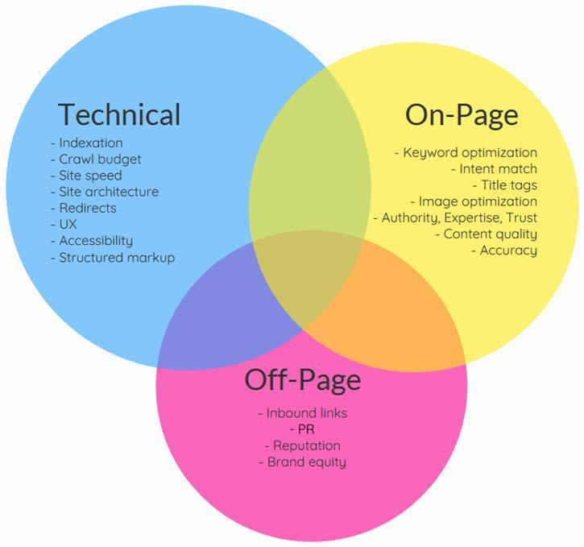

## 1. SEOとは? 🔍

### SEO (Search Engine Optimization)
> 検索エンジン最適化のことを指します。
> 
> ✨ **無料**で検索結果の上位表示を目指す施策です。

### SEM (Search Engine Marketing) 
> 検索エンジンマーケティングのことを指します。
>
> 💰 **有料広告**を使用して検索結果の上位表示を実現します。

### SEOの本質
📌 **重要ポイント**
- 検索エンジンに最適化されたウェブサイト作り
- ユーザーにとって価値のあるコンテンツ提供
- 長期的な視点での継続的な改善が必要

## 2. SEOの要素

### 2-2. オンサープSEO
検索結果ページ（SERP）での最適化を指します。

**主な目的**:
- 競合との差別化
- クリック率の向上  
- リッチスニペットの表示（構造化データの活用）

### 2-3. オフページSEO
外部サイトからの評価に関する最適化を指します。

**バックリンクとは**
> 他のウェブサイトから自社サイトへのリンクのことです。

**バックリンクが重要な理由**:
- サイトの信頼性・権威性の指標となる
- 質の高いバックリンクは検索順位の向上に貢献
- 外部からの評価として検索エンジンに認識される

## 3. SEO実施プロセス

### 3-1. ビジネス分析
- 自社の強み（DCA：主要な競争優位性）
- 主要ターゲット層の特定
- 市場環境の把握
- デジタル競争力の評価
- 競合のSEO戦略分析

### 3-2. テクニカルSEO
- HTTPSの導入
- サイトマップ（sitemap.xml）の作成・更新
- robots.txtの適切な設定
- モバイルフレンドリー対応
- ページ読み込み速度の最適化

### 3-3. キーワードリサーチ
- キーワード選定：ターゲットユーザーの検索意図
- 検索ボリューム分析
- コンテンツフォーマットの検討

### 3-4. コンテンツSEO

### 3-5. オンサープSEO

### 3-6. オフページSEO
