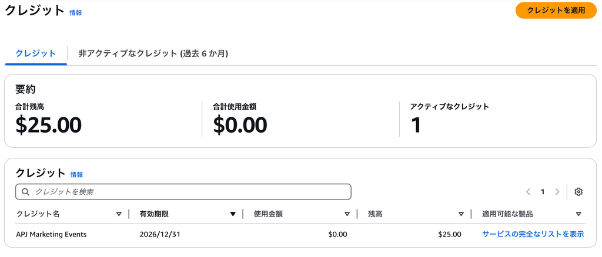

# AWS Summit Japan 2025 参加レポート

先日、[AWS Summit Japan 2025](https://aws.amazon.com/jp/summits/japan/)に参加してきました。今回は技術的な詳細よりも、企業のユースケースやAWSサービスの実践的な活用方法が中心となるイベントでした。特に印象的だったのは、セキュリティ分野と人工知能（AI）分野の最新動向についてです。

> **📅 イベント情報**  
> - **開催日**: 2025年6月25日-26日  
> - **会場**: 幕張メッセ  
> - **セッション数**: 160+セッション

## セキュリティ分野の最新動向

### 増加するサイバー攻撃の現状

2025年に入ってから、DDoS攻撃やランサムウェア攻撃が急増しているという現状が共有されました。特に中小企業をターゲットとした攻撃が増加しており、従来のセキュリティ対策では対応が困難な状況になっています。

### AIを活用したセキュリティ対策

これに対応するためのインフラやサービスの紹介があり、**AIを活用した自動的なセキュリティルールの生成と強化**が今後の主流になっていくという内容でした。

具体的には、人手で設定していたルールをAIが自動で学習し、継続的に最適化していく仕組みが紹介されました。これにより、未知の攻撃パターンにも迅速に対応できるようになるとのことです。

### セキュリティインシデント対応プレイブック

AWSからはセキュリティインシデント対応のためのプレイブックも共有されました。特に注目されたのは、[AWS Customer Playbook Framework](https://github.com/aws-samples/aws-customer-playbook-framework/blob/main/docs/ja/ja.Denial_of_Service.md)で公開されているDDoS対策用のプレイブックです：

- **DDoSの予防策**
- **発生時の対応手順**
- **報告の際のチェックポイント**

などが明確に整理されており、有事の際に非常に参考になる資料です。このプレイブックは日本語で提供されており、実際のインシデント対応時に即座に参照できる実用的な内容となっています。

#### 🔗 関連リソース

- **[AWS Well-Architected Framework - Security Pillar](https://docs.aws.amazon.com/wellarchitected/latest/security-pillar/welcome.html)**: セキュリティ設計のベストプラクティス
- **[AWS Customer Playbook Framework - DDoS対応](https://github.com/aws-samples/aws-customer-playbook-framework/blob/main/docs/ja/ja.Denial_of_Service.md)**: DDoS攻撃対応の詳細プレイブック（日本語版）
- **[AWS Security Incident Response Playbook](https://github.com/aws-samples/aws-security-incident-response-playbook)**: GitHubで公開されているインシデント対応プレイブック
- **[AWS Security Best Practices](https://aws.amazon.com/security/security-resources/)**: セキュリティ関連のリソース集

## AI分野の最新動向

### 企業でのAI活用事例

AI分野では、様々な企業でのAI活用の取り組みが紹介されました。特に注目されたのは、**ChatGPTのような生成系AIをベースにした社内向けのAIモデルの構築と導入事例**でした。

### コンサルティングAIの事例

過去のコンサルティング実績やクライアント情報を学習したAIが、コンサルティングの方向性や資料作成に関する問い合わせに対応できるよう設計されています。これにより、経験豊富なコンサルタントの知識を組織全体で共有できるようになるとのことです。

### AI活用のベストプラクティス

セッションでは以下のようなAI活用のベストプラクティスも紹介されました：

- **段階的な導入**: 小さなプロジェクトから始めて徐々にスケールアップ
- **データの品質管理**: AIの精度向上のためには高品質なデータが重要
- **人材育成**: AIを活用できる人材の育成が急務

#### 🤖 AWS AI/ML サービス

- **[Amazon Bedrock](https://aws.amazon.com/bedrock/)**: 生成AIアプリケーション構築のためのマネージドサービス
- **[Amazon SageMaker](https://aws.amazon.com/sagemaker/)**: 機械学習のための完全マネージドプラットフォーム
- **[Amazon Comprehend](https://aws.amazon.com/comprehend/)**: 自然言語処理サービス
- **[Amazon Rekognition](https://aws.amazon.com/rekognition/)**: 画像・動画分析サービス

## その他の注目ポイント

### クラウドネイティブ開発

AWSの最新サービスを活用したクラウドネイティブ開発の事例も多数紹介されました。特に、マイクロサービスアーキテクチャとコンテナ技術の組み合わせによる開発効率の向上について詳しく説明されていました。

#### 🐳 コンテナ・オーケストレーション

- **[Amazon EKS](https://aws.amazon.com/eks/)**: マネージドKubernetesサービス
- **[Amazon ECS](https://aws.amazon.com/ecs/)**: コンテナオーケストレーションサービス
- **[AWS Fargate](https://aws.amazon.com/fargate/)**: サーバーレスコンテナ実行環境

### コスト最適化

クラウド利用におけるコスト最適化の重要性も強調されていました。適切なリソース選択とモニタリングにより、大幅なコスト削減が可能であることが示されました。

#### 💰 コスト最適化ツール

- **[AWS Cost Explorer](https://aws.amazon.com/aws-cost-management/aws-cost-explorer/)**: コスト分析・可視化ツール
- **[AWS Budgets](https://aws.amazon.com/aws-cost-management/aws-budgets/)**: 予算設定・アラート機能
- **[AWS Trusted Advisor](https://aws.amazon.com/premiumsupport/technology/trusted-advisor/)**: コスト最適化推奨事項

### サーバーレスアーキテクチャ

サーバーレスアーキテクチャの活用事例も多数紹介されました。特に、AWS LambdaとAPI Gatewayを組み合わせた効率的なアプリケーション開発について詳しく説明されていました。

#### ⚡ サーバーレスサービス

- **[AWS Lambda](https://aws.amazon.com/lambda/)**: サーバーレスコンピューティング
- **[Amazon API Gateway](https://aws.amazon.com/api-gateway/)**: API管理サービス
- **[Amazon EventBridge](https://aws.amazon.com/eventbridge/)**: イベント駆動アーキテクチャ

## 今後の展望

### マルチクラウド戦略

多くの企業がマルチクラウド戦略を採用しており、AWS以外のクラウドプロバイダーとの連携も重要になってきています。適切なクラウド選択とデータの可搬性が今後の課題として挙げられました。

### エッジコンピューティング

IoTデバイスの増加に伴い、エッジコンピューティングの重要性も高まっています。AWS IoT CoreやAWS Greengrassを活用したエッジソリューションの事例も紹介されました。

#### 🌐 エッジ・IoTサービス

- **[AWS IoT Core](https://aws.amazon.com/iot-core/)**: IoTデバイス接続・管理サービス
- **[AWS Greengrass](https://aws.amazon.com/greengrass/)**: エッジコンピューティングソフトウェア
- **[AWS Wavelength](https://aws.amazon.com/wavelength/)**: 5Gエッジコンピューティング
- **[Amazon Kinesis](https://aws.amazon.com/kinesis/)**: リアルタイムデータストリーミング

## まとめ

今回のAWS Summit Japan 2025では、セキュリティとAIの分野で大きな変化が起きていることが実感できました。特に、AIを活用した自動化が各分野で進んでおり、従来の手動プロセスが大きく変革されつつあります。

今後は、これらの技術を適切に活用し、継続的な学習とアップデートが重要になると感じました。また、セキュリティ対策の自動化とAIの実践的な活用が、今後のクラウド戦略の鍵となることが分かりました。

### 📚 追加学習リソース

- **[AWS Training and Certification](https://aws.amazon.com/training/)**: 公式トレーニングコース
- **[AWS Well-Architected Framework](https://aws.amazon.com/architecture/well-architected/)**: アーキテクチャ設計ガイド
- **[AWS Architecture Center](https://aws.amazon.com/architecture/)**: ソリューションアーキテクチャ集
- **[AWS re:Post](https://repost.aws/)**: AWSコミュニティQ&Aサイト

### 🎯 次のステップ

1. **セキュリティ強化**: AWS Well-Architected FrameworkのSecurity Pillarを参考にセキュリティ設計を見直す
2. **AI/ML導入**: 小さなプロジェクトから始めて段階的にAI/MLを導入する
3. **コスト最適化**: AWS Cost Explorerを活用してコスト分析を実施する
4. **継続学習**: AWS公式トレーニングを受講してスキルアップを図る

---

**参加特典**: アンケートに回答するとAWSクレジットももらえます！

---

*この記事が役に立った場合は、ぜひシェアしてください！また、AWS Summit Japan 2025に参加された方の感想もお聞かせください。*