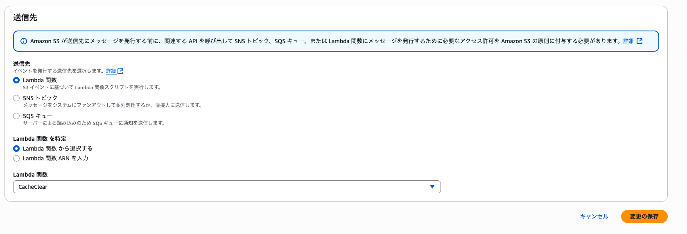

# AWS LambdaでCloudFrontキャッシュを自動削除する方法

CloudFrontを使用する環境で、同じファイル名でS3の画像を更新する際に、以前のファイルが継続して表示される問題を解決する方法をご紹介します。

## 📋 目次
1. [問題の状況](#1-問題の状況)
2. [事前準備](#2-事前準備)
3. [Lambda関数の作成](#3-lambda関数の作成)
4. [S3イベント設定](#4-s3イベント設定)
5. [テストと確認](#5-テストと確認)
6. [参考資料](#6-参考資料)

## 1. 問題の状況

### 1.1 CloudFrontキャッシュの問題点

CloudFrontは基本的に24時間キャッシュを保持します。そのため、同じファイル名でS3の画像を更新しても、以前の画像が継続して表示される問題が発生します。

この問題は以下のような場面で特に顕著に現れます：
- **ECサイトの商品画像更新**: 同じファイル名で商品画像を差し替えたが、古い画像が表示され続ける
- **ブログの画像更新**: 記事内の画像を更新したが、キャッシュされた古い画像が表示される
- **アプリケーションのアイコン更新**: アプリのアイコンファイルを更新したが、古いアイコンが表示される

### 1.2 従来の解決方法とその課題

従来、この問題を解決するためには以下のような方法が使われていました：

**手動でのキャッシュ無効化**
- CloudFrontコンソールから手動で無効化パスを指定
- 時間がかかり、リアルタイム性に欠ける
- 複数ファイルの更新時に作業量が膨大

**ファイル名の変更**
- ファイル名にタイムスタンプやバージョン番号を付与
- アプリケーション側のコード修正が必要
- ファイル管理が複雑になる


## 2. 事前準備

### 2.1 必要な環境とリソース

このチュートリアルを進める前に、以下が準備されている必要があります：

- ✅ **AWSアカウント**: 有効なAWSアカウントと適切な権限
- ✅ **S3バケット作成完了**: 静的ファイルを保存するS3バケット
- ✅ **CloudFront配信作成完了**: S3バケットをオリジンとするCloudFront配信
- ✅ **CloudFront Distribution ID確認**: 無効化処理に必要なDistribution ID

### 2.2 必要なAWSサービスとその役割

**CloudFront (Content Delivery Network)**
- 世界中のエッジロケーションからコンテンツを配信
- キャッシュ機能により高速なコンテンツ配信を実現
- 無効化APIによりキャッシュの即座な削除が可能

**S3 (Simple Storage Service)**
- 静的ファイル（画像、CSS、JavaScript等）の保存
- イベント通知機能によりファイル更新を検知
- Lambda関数との連携により自動処理を実現

**Lambda (サーバーレス関数)**
- サーバー管理不要でコードを実行
- S3イベントと連携して自動的にキャッシュ無効化を実行
- 従量課金制でコスト効率が良い

### 2.3 想定コスト

このソリューションの運用コストは以下の通りです：

- **Lambda実行**: 月100万リクエストまで無料、以降$0.20/100万リクエスト
- **CloudFront無効化**: 月1,000パスまで無料、以降$0.005/パス
- **S3イベント通知**: 無料

小規模なサイトでは月額数円程度、中規模サイトでも月額数百円程度のコストで運用可能です。

## 3. Lambda関数の作成

### 3.1 Lambda関数の作成

Lambda関数は、S3にファイルがアップロードされた際に自動的にCloudFrontのキャッシュを無効化する役割を担います。

**Lambda関数の動作フロー**
1. S3にファイルがアップロードされる
2. S3イベント通知がLambda関数をトリガー
3. Lambda関数がCloudFront無効化APIを呼び出し
4. 指定されたパスのキャッシュが即座に無効化される

**作成手順**

1. AWS Lambdaコンソールにアクセスします
2. 「関数の作成」ボタンをクリックします


3. 以下の設定で関数を作成します：
   - **関数名**: `cloudfront-cache-invalidator`など（分かりやすい名前を設定）
   - **ランタイム**: `Node.js 18.x`（最新のLTS版を推奨）
   - **アーキテクチャ**: `x86_64`（互換性とパフォーマンスのバランス）


**関数名の命名規則**
- 小文字とハイフンのみ使用
- 機能が分かりやすい名前を設定
- 例：`cloudfront-cache-invalidator`、`s3-cloudfront-sync`など

### 3.2 環境変数の設定

CloudFront Distribution IDを環境変数として設定します。環境変数を使用することで、コード内にハードコードすることなく、セキュアにDistribution IDを管理できます。

**環境変数の利点**
- コードの変更なしで設定を変更可能
- 複数の環境（開発、本番）で同じコードを使用可能
- 機密情報をコードから分離して管理

**設定手順**

1. Lambda関数の「設定」タブに移動
2. 「環境変数」セクションで「編集」をクリック
3. 以下の環境変数を追加：
   - **キー**: `DISTRIBUTION_ID`
   - **値**: `E3XXXXXXXXX` (実際のDistribution IDに変更)


**Distribution IDの確認方法**
1. CloudFrontコンソールにアクセス
2. 対象の配信を選択
3. 「一般」タブの「配信ID」をコピー

**セキュリティのベストプラクティス**
- 本番環境では暗号化された環境変数を使用
- 最小権限の原則に従い、必要最小限の権限のみ付与
- 定期的な権限の見直しとローテーション

### 3.3 Lambda関数コードの作成

このコードは、S3イベントを受信してCloudFrontのキャッシュ無効化を実行するLambda関数です。

**コードの主要機能**
- S3イベントからファイルパスを抽出
- CloudFront無効化APIを呼び出し
- エラーハンドリングとログ出力
- 適切なHTTPレスポンスの返却

**コードの詳細説明**

以下のコードをLambda関数に入力します：

```javascript
const AWS = require('aws-sdk');
const cloudfront = new AWS.CloudFront();

exports.handler = async (event) => {
  try {
    console.log('S3 Event:', JSON.stringify(event));
    
    // S3イベントからファイル情報を抽出
    const record = event.Records[0];
    const rawKey = record.s3.object.key;
    const key = decodeURIComponent(rawKey.replace(/\+/g, ' '));
    const path = `/${key}`;
    
    // CloudFrontキャッシュ無効化の設定
    const params = {
      DistributionId: process.env.DISTRIBUTION_ID,
      InvalidationBatch: {
        CallerReference: `${Date.now()}`,
        Paths: {
          Quantity: 1,
          Items: [path],
        },
      },
    };
    
    // キャッシュ無効化の実行
    const result = await cloudfront.createInvalidation(params).promise();
    console.log('Invalidation created:', result.Invalidation.Id);
    
    return {
      statusCode: 200,
      body: JSON.stringify({ 
        message: 'Invalidation requested', 
        invalidationId: result.Invalidation.Id 
      }),
    };
  } catch (err) {
    console.error('Error:', err);
    return {
      statusCode: 500,
      body: JSON.stringify({ 
        message: 'Error', 
        error: err.message 
      }),
    };
  }
};
```


### 3.4 関数のデプロイ

コード作成完了後、**「Deploy」**ボタンをクリックして関数をデプロイします。

**デプロイ後の確認事項**
- 関数が正常にデプロイされたか確認
- 環境変数が正しく設定されているか確認
- 実行ロールに必要な権限が付与されているか確認

**必要なIAM権限**
Lambda関数がCloudFront無効化を実行するために、以下の権限が必要です：

```json
{
    "Version": "2012-10-17",
    "Statement": [
        {
            "Effect": "Allow",
            "Action": [
                "cloudfront:CreateInvalidation"
            ],
            "Resource": "arn:aws:cloudfront::*:distribution/*"
        }
    ]
}
```

**トラブルシューティング**
- デプロイエラーが発生した場合、コードの構文を確認
- 権限エラーが発生した場合、IAMロールの設定を確認
- 環境変数が読み込まれない場合、設定画面で値を再確認

## 4. S3イベント設定

S3イベント設定により、ファイルがアップロードされた際に自動的にLambda関数が実行されるようになります。

### 4.1 S3バケットプロパティ設定

S3バケットのイベント通知機能を使用して、ファイルの更新を検知します。

**イベント通知の仕組み**
- S3にファイルがアップロードされる
- 設定されたイベント通知がトリガーされる
- 指定されたLambda関数が自動実行される
- リアルタイムでのキャッシュ無効化が実現される

**設定手順**

1. S3コンソールで該当バケットに移動
2. 「プロパティ」タブをクリックします


**イベント通知の利点**
- リアルタイムでの処理実行
- サーバー管理不要
- 従量課金制でコスト効率が良い
- 高可用性とスケーラビリティ

### 4.2 イベント通知の作成

S3イベント通知を作成して、ファイルの更新を検知できるようにします。

**イベント通知の種類**
- **PUT**: ファイルのアップロード・更新
- **POST**: マルチパートアップロードの完了
- **DELETE**: ファイルの削除
- **COPY**: ファイルのコピー

**作成手順**

1. 「イベント通知」セクションまでスクロール
2. 「イベント通知の作成」ボタンをクリックします


### 4.3 イベント設定

イベント通知の詳細設定を行います。適切な設定により、不要な処理を避け、コストを最適化できます。

**設定項目の詳細**

1. **イベント名**: `cloudfront-cache-invalidation`（分かりやすい名前を設定）
2. **プレフィックス**: 必要に応じて設定（例：`images/`、`assets/`）
   - 特定のフォルダ内のファイルのみを対象とする場合に使用
   - 空欄の場合はバケット内のすべてのファイルが対象
3. **サフィックス**: `.jpg`（JPGファイルのみ対象）
   - 特定の拡張子のファイルのみを対象とする場合に使用
   - 例：`.jpg`、`.png`、`.css`、`.js`など
4. **イベントタイプ**: `PUT`を選択
   - ファイルのアップロード・更新時にトリガー


**フィルタリングの重要性**
- 不要なファイル更新でのLambda実行を防ぐ
- コストの最適化
- 処理の効率化

### 4.4 Lambda関数の接続

作成したLambda関数をイベント通知のターゲットとして設定します。

**接続手順**

1. 「ターゲット」セクションで「Lambda関数」を選択
2. 先ほど作成したLambda関数を選択します



**接続後の確認事項**
- Lambda関数が正しく選択されているか確認
- 必要な権限が付与されているか確認
- テスト実行で動作確認を行う

## 5. テストと確認

設定が完了したら、実際にファイルをアップロードしてシステムが正常に動作するかテストします。

### 5.1 テストファイルのアップロード

まず、基本的な動作確認を行います。

**テスト手順**

1. S3にテスト用画像ファイルをアップロードします
2. CloudFront URLにアクセスして画像が正常に表示されるか確認します


**確認ポイント**
- ファイルが正常にアップロードされているか
- CloudFront URLで画像が表示されるか
- 初回アクセス時の表示時間
- ブラウザのキャッシュクリア後の表示

### 5.2 ファイル更新テスト

同じファイル名でファイルを更新し、キャッシュ無効化が正常に動作するかテストします。

**更新テスト手順**

1. 同じファイル名で別の画像をアップロードします
2. CloudFront URLにアクセスして新しい画像が表示されるか確認します


**期待される結果**
- ファイル更新後、数秒以内に新しい画像が表示される
- 古いキャッシュが無効化されている
- Lambda関数が正常に実行されている

### 5.3 キャッシュ無効化の確認

CloudFrontコンソールで無効化の実行状況を確認できます。

**確認方法**

CloudFrontコンソールで無効化状態を確認できます：


**確認項目**
- 無効化リクエストが正常に送信されているか
- 無効化のステータス（進行中、完了）
- 無効化の実行時間
- エラーが発生していないか

**トラブルシューティング**
- 無効化が実行されない場合：Lambda関数のログを確認
- 権限エラーが発生する場合：IAMロールの設定を確認
- 環境変数が読み込まれない場合：Lambda関数の設定を確認


## 6. 参考資料

- [AWS CloudFront公式ドキュメント](https://docs.aws.amazon.com/cloudfront/)
- [AWS Lambda公式ドキュメント](https://docs.aws.amazon.com/lambda/)
- [S3イベント通知設定ガイド](https://docs.aws.amazon.com/AmazonS3/latest/userguide/EventNotifications.html)
- [CloudFrontキャッシュ無効化API](https://docs.aws.amazon.com/cloudfront/latest/APIReference/API_CreateInvalidation.html)

## 注意事項

- CloudFrontキャッシュ無効化は有料サービスです
- 無効化リクエストは月1,000件まで無料です
- 大量のファイルを頻繁に更新する場合はコストを考慮する必要があります

これでS3にファイルをアップロードするたびに自動的にCloudFrontキャッシュが無効化され、最新ファイルが即座に反映されます！

