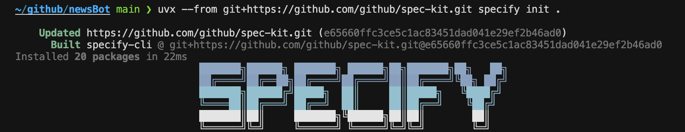

# CursorでSpeckitを使ってみた

GitHub が公開した **Speckit（spec-kit）** は、AIエージェントを活用した仕様駆動開発を支援するツールです。今回は Cursor エディタで実際に使ってみた感想と使い方をまとめます。

> **📌 Speckitとは？**
> GitHubが開発した仕様駆動開発ツールで、自然言語で仕様を書くとAIが設計書・実装計画・タスク分解・実装まで一貫してサポートしてくれます。

## Speckitの特徴

### 仕様駆動開発（Spec-Driven Development）

従来の開発フローでは「コードを書きながら仕様を固める」ことが多いですが、Speckitは**仕様を先に明確化し、そこからAIが自動的に設計・実装を進める**アプローチを取ります。

- **曖昧さの排除**: 自然言語の仕様をAIが構造化
- **一貫性の確保**: 仕様 → 設計 → 実装の流れが自動化
- **ドキュメント自動生成**: 設計書やタスクリストが自動で作成される

### 対応エディタ・エージェント

Speckitは複数のAIエディタ・エージェントに対応しています：

- **Cursor** ✅
- **VS Code + Copilot**
- **Claude Code**
- **Windsurf**

---

## インストールと初期設定

### 1. プロジェクトの初期化

プロジェクトフォルダを作成し、以下のコマンドでSpeckitを初期化します：

```bash
uvx --from git+https://github.com/github/spec-kit.git specify init .
```



エージェントと環境を選択すると、必要なファイルが自動生成されます。

### 2. 生成されるファイル構成

初期化後、以下のようなディレクトリ構造が作成されます：

```
project/
├── .cursor
│   └── commands
│       ├── speckit.analyze.md
│       ├── speckit.checklist.md
│       ├── speckit.clarify.md
│       ├── speckit.constitution.md
│       ├── speckit.implement.md
│       ├── speckit.plan.md
│       ├── speckit.specify.md
│       └── speckit.tasks.md
└── .specify
    ├── memory
    │   └── constitution.md
    ├── scripts
    │   └── bash
    │       ├── check-prerequisites.sh
    │       ├── common.sh
    │       ├── create-new-feature.sh
    │       ├── setup-plan.sh
    │       └── update-agent-context.sh
    └── templates
        ├── agent-file-template.md
        ├── checklist-template.md
        ├── plan-template.md
        ├── spec-template.md
        └── tasks-template.md
```

---

## 開発ワークフロー

Speckitは以下の5つのステップで開発を進めます：

### Step 1: 仕様定義（/specify）

`/specify` コマンドで、作りたい機能を自然言語で説明します。

**例：カカオトークニュース配信ボット**

```
目的：
- 毎朝8時にユーザーに日本語ニュースを配信
- 重要部分のみ短くまとめて送信
- ユーザーが興味のあるカテゴリを事前に選択可能
- 勉強目的で、重要単語には翻訳・解説を付与

技術要件：
- ニュースの要約、重要単語抽出は Gemini AI を利用
- カテゴリごとのパーソナライズ配信
- スマートフォンで受信可能
- 毎日自動で配信
```

コマンドを実行すると、仕様書（`spec.md`）が自動生成されます。

### Step 2: 実装計画（/plan）

`/plan` コマンドで、仕様に基づいた技術的な実装計画を生成します。

**生成される設計ドキュメント：**

| ファイル名 | 内容 | 用途 |
|-----------|------|------|
| `plan.md` | 技術的な実装計画の詳細 | 開発チーム向けの設計指針 |
| `data-model.md` | データベース設計とAPI仕様 | データ構造の標準化 |
| `quickstart.md` | 開発環境構築手順 | 新しいメンバーのオンボーディング |
| `research.md` | 技術選定の根拠と比較検討結果 | 意思決定の透明性確保 |

**推奨される技術スタック例：**
- **Node.jsサーバー**: Express または NestJS
- **データベース**: MySQL
- **ORM**: Prisma
- **AI**: Gemini AI（ニュース要約および重要単語抽出）
- **カカオトークボット**: KakaoTalk Chatbot API
- **スケジューリング**: node-cron

### Step 3: タスク分解（/tasks）

`/tasks` コマンドで、実装計画を具体的なタスクに分解します。

- 各タスクは実装可能な単位に分割
- 優先順位と依存関係が明確化
- チェックリスト形式で進捗管理可能

### Step 4: 実装（/implement）

`/implement` コマンドで、タスクに基づいてAIがコードを生成します。

- 仕様と設計に沿ったコード生成
- テストコードも同時に生成可能
- コードレビューポイントも提示

### Step 5: 分析・改善（/analyze, /checklist）

- `/analyze`: 既存コードの分析と改善提案
- `/checklist`: 品質チェックリストの生成

---

## 使ってみた感想

### 良かった点

| ポイント | 詳細 |
|---------|------|
| **ドキュメント自動生成** | 仕様書、設計書、タスクリストが自動で作られるので、ドキュメント作成の手間が大幅に削減 |
| **一貫性のある開発** | 仕様→設計→実装の流れが明確で、途中でブレにくい |
| **学習コストが低い** | 自然言語で仕様を書くだけなので、非エンジニアでも参加しやすい |
| **複数エディタ対応** | Cursor以外にもVS Code、Claude Codeなど幅広く対応 |

### 改善してほしい点

| ポイント | 詳細 |
|---------|------|
| **日本語対応** | 現時点では英語がメインで、日本語での仕様記述は精度が落ちる場合がある |
| **大規模プロジェクト** | 小〜中規模のプロジェクトには最適だが、大規模になると管理が複雑になりそう |
| **カスタマイズ性** | テンプレートのカスタマイズがやや難しい |

---

## まとめ

Speckitは「**仕様を書けば、あとはAIが全部やってくれる**」という未来の開発スタイルを体験できるツールです。

特に以下のような場面で威力を発揮します：

- **個人開発・サイドプロジェクト**: 一人で設計からテストまで効率的に進められる
- **プロトタイプ作成**: アイデアを素早く形にできる
- **チーム開発のキックオフ**: 仕様と設計を共有しやすい

AIエディタを使っている方は、ぜひ一度試してみてください！

### 🔗 関連リンク

- **[GitHub spec-kit リポジトリ](https://github.com/github/spec-kit)**: 公式リポジトリ
- **[Cursor](https://cursor.sh/)**: AI搭載コードエディタ
- **[GitHub Copilot](https://github.com/features/copilot)**: GitHub公式AIアシスタント

---

*この記事が役に立った場合は、ぜひシェアしてください！Speckitを使った感想もお聞かせください。*

